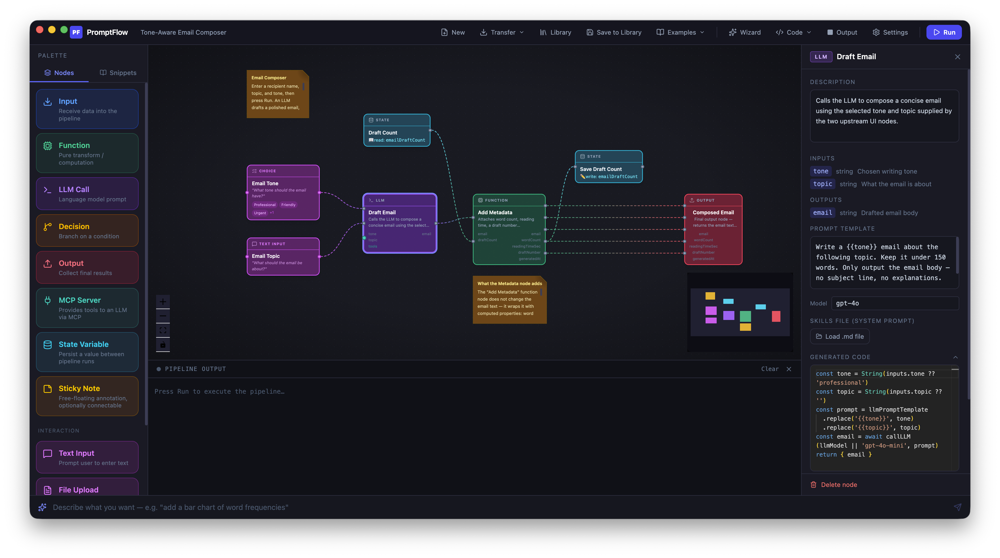

# PromptFlow IDE

> *A visual node-graph IDE for prompt-driven development — where workflows are first-class programs, not afterthoughts.*



---

## Why PromptFlow?

Two ideas drove this project:

1. **A world without source code** — As LLMs increasingly write and reason about code, why keep it in a form designed for humans? PromptFlow explores a future where programs are structured node graphs: unambiguous, provable, and directly manipulable by AI systems.

2. **Never lose a workflow again** — If you work with LLMs daily, you've built dozens of one-off document processing scripts, summarisers, classifiers, and chains — then lost them. PromptFlow is a personal library for all of them, with a visual editor to build, refine, and reuse.

---

## Quick Start

```bash
git clone https://github.com/johnalexander/promptflow.git
cd promptflow
npm install
npm run dev        # Electron + Vite hot-reload
```

To build a production binary:

```bash
npm run build      # compiles renderer + main
npm start          # runs the built app
```

**Requirements:** Node.js 18+, npm 9+

---

## Features

### 🔷 Visual Node Canvas
- Drag-and-drop node graph built on [ReactFlow](https://reactflow.dev)
- Connect nodes by dragging from output handles to input handles
- Minimap, zoom, pan — full graph navigation
- Gradient edges with animated flow indicators

### 🧩 Node Types
| Node | Colour | Purpose |
|------|--------|---------|
| **Input** | Blue | Receives pipeline input data |
| **Function** | Green | Pure JavaScript transform |
| **LLM** | Purple | Language model call (OpenAI / Ollama) |
| **Decision** | Amber | Conditional branching (if/else) |
| **Output** | Red | Collects and displays final result |
| **Pipe** | Cyan | Reformats data between nodes |
| **Interaction** | Fuchsia | UI widgets: text input, buttons, sliders, selects |
| **State** | Cyan | Persistent key/value store (read or write) |
| **MCP Server** | Teal | Connects an MCP tool server to an LLM node |
| **Workflow** | Indigo | Embeds a saved library project as a reusable sub-workflow |
| **Sticky Note** | Yellow | Annotations — not executed |

### 🤖 LLM Integration
- **OpenAI** models: set `OPENAI_API_KEY` in environment
- **Ollama** (local): select any model prefixed `ollama/` (e.g. `ollama/llama3`), runs at `localhost:11434`
- **MCP tools**: wire an MCP Server node to an LLM node to give it tool access (filesystem, web search, GitHub, databases…)

### 🧙 Workflow Wizard
- Click the ✨ sparkle button in the toolbar
- Describe a workflow in plain English — the AI asks clarifying questions, then generates the full node graph
- "Apply to Canvas" replaces (or merges into) the current project

### 📚 Project Library
- All projects saved to `~/Documents/PromptFlow/`
- Open the Library from the toolbar to browse, open, or delete saved workflows
- **Save to Library** stores the current project; **Export** saves to an arbitrary file path
- Library projects appear in the palette **Workflows** section — drag one onto the canvas to use it as a composable sub-workflow node

### 🔁 Sub-Workflows (Composable Nodes)
- Any library project can be embedded as a single **Workflow** node in another project
- Inputs are derived from the sub-workflow's Input nodes; output is `result`
- **Refresh from Library** in the inspector re-syncs ports if the original workflow changed
- Recursive cycle guard prevents a workflow from referencing itself

### ▶️ Code Generation & Execution
- The full node graph compiles to a self-contained async JavaScript pipeline
- Click **Code** in the toolbar to inspect the generated code
- Click **Run** to execute — results appear in the Output panel
- State nodes persist values across runs using the Electron main process

### 🔍 Node Inspector
- Click any node to open the right-hand inspector
- Edit label, description, code (Monaco editor), prompt templates, ports
- LLM nodes: choose model and edit the system/user prompt
- Interaction nodes: configure widget type and label
- MCP nodes: enter server command, test connection, view available tools

### 💬 Natural Language Prompt Bar
- Type commands at the bottom of the canvas, e.g.:
  - *"add a function node called Validate Input that checks the input is not empty"*
  - *"add an LLM node named Classify that categorises the document genre"*
  - *"describe the pipeline"*

---

## Demo Projects

The app ships with several built-in demos (accessible from the **Demos** toolbar menu):

- **Document Analyser** — extracts keywords, summarises, word counts
- **Tone-Aware Email Composer** — drafts emails with tone selection
- **Adventure Game** — interactive branching text game with state
- **Code Reviewer** — reviews code snippets with LLM feedback

---

## Project File Format

Projects are saved as `.promptflow` JSON — structured for version control and LLM consumption:

```json
{
  "id": "uuid",
  "name": "My Workflow",
  "description": "...",
  "nodes": [ { "id": "...", "type": "...", "data": { "kind": "llm", ... } } ],
  "edges": [ { "id": "...", "source": "...", "target": "..." } ],
  "created": "ISO date",
  "updated": "ISO date"
}
```

---

## Architecture

```
src/
├── main/           Electron main process
│   ├── index.ts    IPC handlers: file I/O, code execution, LLM, MCP, state
│   └── mcp/        MCP stdio client (JSON-RPC 2.0 over child_process)
├── preload/        contextBridge — exposes safe IPC API to renderer
└── renderer/src/
    ├── types/      Core types: NodeData, FlowProject, PortDef, ElectronAPI
    ├── store/      Zustand state (nodes, edges, run, project, dirty tracking)
    ├── codegen/    JS code generator (topological sort → async pipeline + IIFE sub-workflows)
    ├── demo/       Built-in starter projects
    └── components/
        ├── Canvas/    ReactFlow canvas + CodeViewer + OutputPanel
        ├── Inspector/ Node detail panel (Monaco editor)
        ├── Palette/   Node type palette + library workflows
        ├── PromptBar/ Natural language command input
        ├── Toolbar/   File ops, demos, wizard, run
        ├── Library/   Library modal (browse + open saved projects)
        └── Wizard/    Workflow Wizard chat panel
```

---

## Contributing

This is an exploratory prototype. Issues and PRs welcome — especially:
- New node types
- Better code generation strategies
- Export to standalone executable
- Collaborative / multi-user editing
